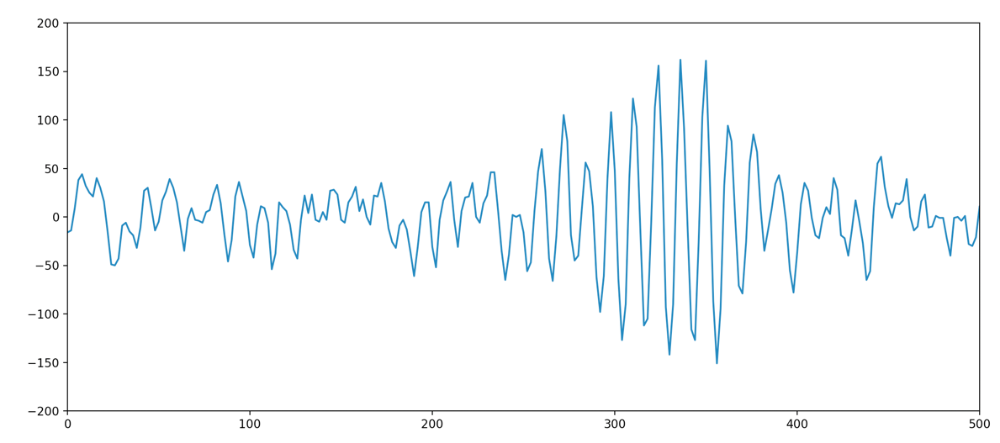
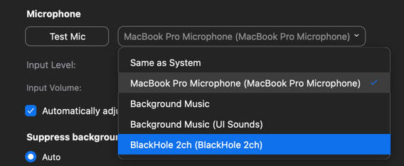

# Broken mic simulator


Adds stimulated lag and distortion to voice that is coming from your mic and sends it to an app of your choice

# Installation
First of all make sure you have a virtual mic that routes audio from one app to another installed. 

- For MacOS I'd recommend <a href="https://github.com/ExistentialAudio/BlackHole"> BlackHole </a>  

- For Windows users <a href="https://vb-audio.com/Voicemeeter/index.htm"> Voicemeeter </a> 

**Clone the Repository**
```
git clone https://github.com/fvviz/Voice-Lag-Simulator.git 
cd Voice-Lag-Simulator
```

**Install requirements**
```
pip3 install -r requirements.txt
```

**Installing pyaudio** can be a little hard and can break into some errors

- Windows users may face `error: Microsoft Visual C++..`. You can refer to <a href="https://stackoverflow.com/questions/59467023/getting-error-microsoft-visual-c-14-0-is-required-when-installing-pyaudio">this</a> for a solution. If this doesnt work go search "how to install pyaudio on windows" and you would find somehting
- MacOS users need to first install **Portaudio** via **Homebrew** to download pyaudio. 
  - If you are on an **Apple Silicon Mac** then you can refer to <a href="https://stackoverflow.com/questions/65709212/import-pyaudio-doesnt-work-symbol-not-found-pamaccore-setupchannelmap-on-ma"> this </a> as this was the only solution that worked for me
  
  
 If You still cant get pyaudio to install on your computer just look for a solution on youtube or other websites. 

# Setup and Running

Once Pyaudio is setup head over to the constants.json file to setup the configurations

**Selecting Your Virtual Microphone**

- To check if the program detects your virtual mic, run
`python3 mics.py`Your virtual mic has to be listed in the output. 

- Now, Head over to constants.json and set `"virtual_mic"` to the name of your virtual mic. Now you are all good to go, Run

```
python3 main.py
```

Now to get the virtual mic input into other applications, head over to the application (im using Zoom in this case) and select the name of your virtual microphone



